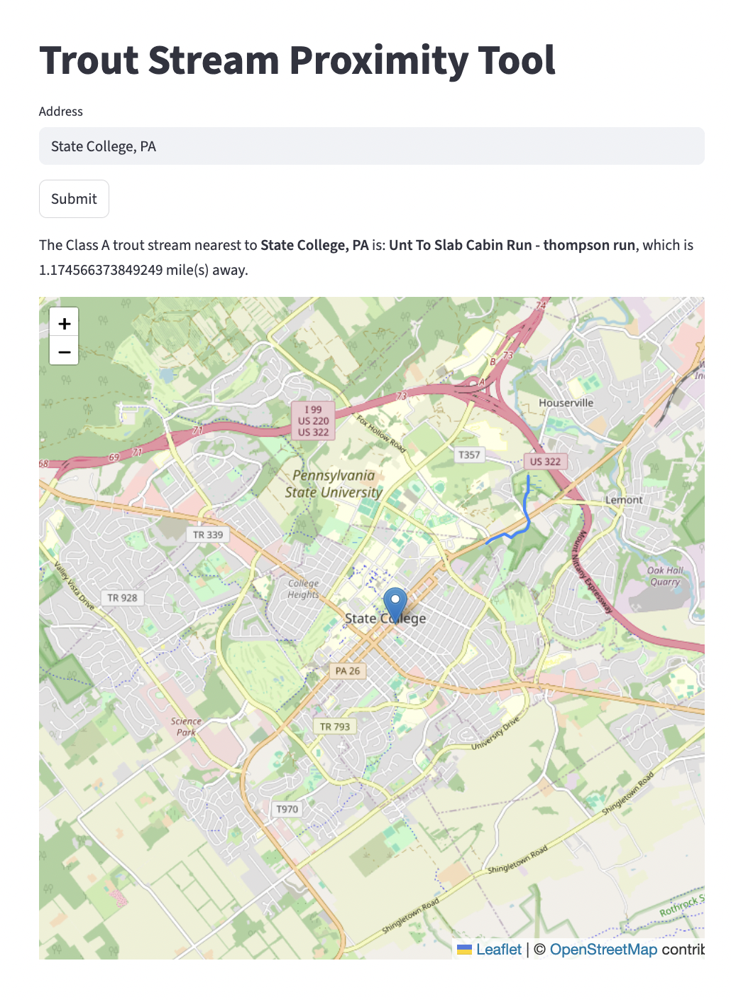

# Trout Stream Proximity Tool

## What is this?

Trout Stream Proximity Tool helps property hunters assess proximity to Pennsylvania's Class A wild trout waters by analyzing PA Fish & Boat stream classification data and calculating distances to the nearest Class A stream.

## Why?

When property hunting in rural PA, it's impossible to know how close a parcel is to quality wild trout fishing. Real estate listings don't include this information, and manually cross-referencing maps is tedious and error-prone. This tool automates the spatial analysis.

## How do I use it?

Enter a Pennsylvania property address and the tool returns the nearest Class A wild trout stream with distance in miles, percent on public land, and an interactive map.



## Setup & Installation

### Prerequisites

- Python 3.13+
- [Google Maps Geocoding API key](https://developers.google.com/maps/documentation/geocoding)

### Install

1. Clone the repo

    ```bash
       git clone https://github.com/bakertj3/trout-stream-proximity-tool.git
       cd trout-stream-proximity-tool
    ```

2. Install dependencies

    ```bash
       pip install -e .
    ```

3. Create a `.env` file in the project root and add your API key

    ```text
       GOOGLE_MAPS_API_KEY=your_key_here
    ```

### Run

```bash
streamlit run src/app.py
```

## Development Methodology

### AI-Assisted Project Planning

This project used AI (Claude) to create a structured execution plan
with realistic milestones and time-boxing. This approach helped combat
common developer challenges:

- Scope creep and feature bloat
- Unlimited research without implementation
- Half-finished projects
- Unrealistic timelines

The AI provided:

- Project management framework
- TDD milestone suggestions
- Time-boxed research phases
- Accountability structure
- Feedback and coaching

I was responsible for:

- All technical decisions (documented in ADRs)
- Code implementation and learning
- Test design and implementation  
- Problem-solving and debugging
- Scope adjustments based on real constraints
